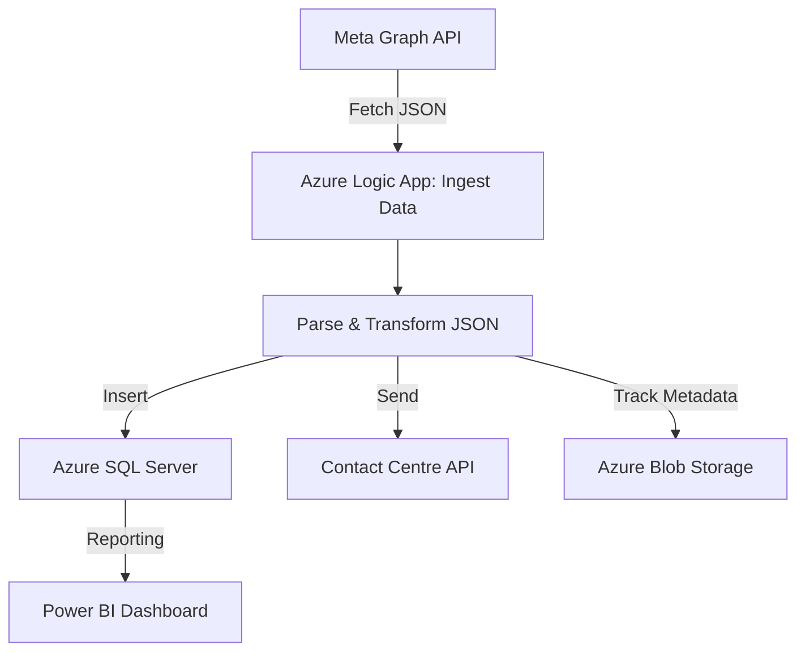

**Figure:** High-level architecture of the Meta API Contact Centre Pipeline

This pipeline ingests campaign data from Meta via the Graph API, parses and transforms deeply nested JSON in Azure Logic Apps, and then both inserts structured data into SQL Server and sends formatted payloads to the contact centre API. Metadata about each run is tracked in Azure Blob Storage. The resulting data supports real-time Power BI dashboards for business insights.
