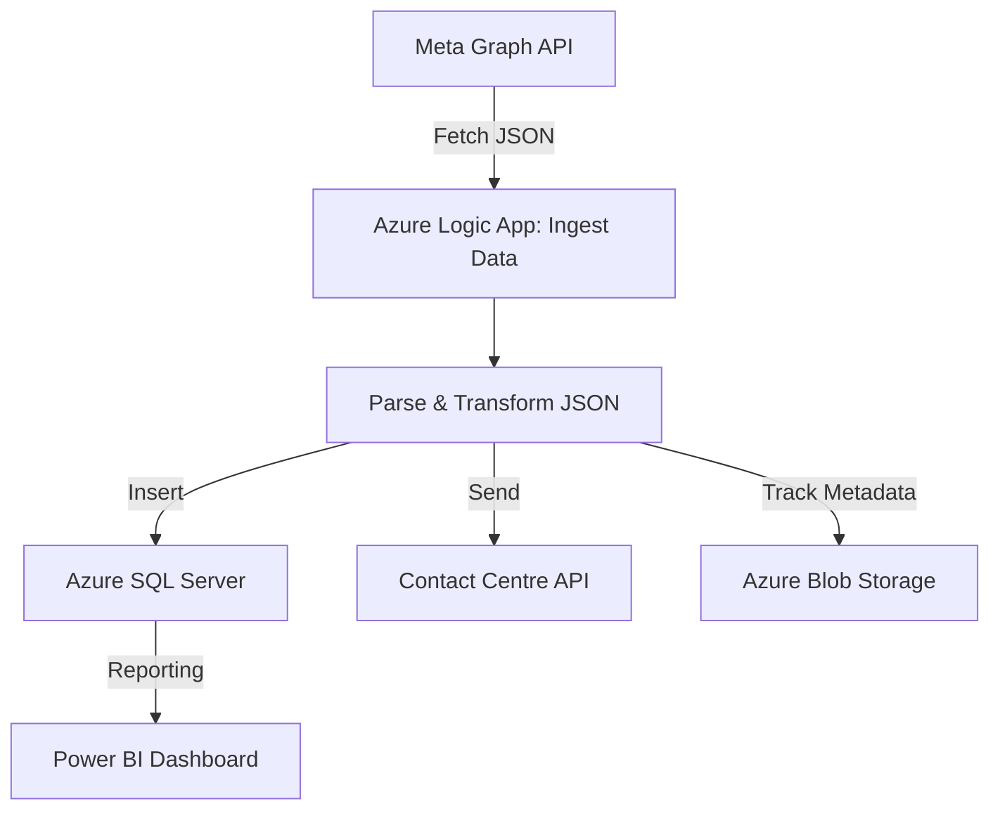

# Meta API Integration – Contact Centre Data Transfer

This internal automation project replaced a manual process by implementing a data pipeline that transferred campaign data from Meta into our contact centre system and SQL Server database.

##  Project Overview

Using **Graph API** and **Azure Logic Apps**, I retrieved complex, deeply nested JSON data. One of the key challenges was handling its irregular structure, which I solved through custom parsing and mapping logic.

The Logic App was scheduled to run **every 30 minutes**, as requested by the call centre team, and included **built-in control checks**. I used **Excel** for validation and testing during development and implemented **Azure Monitor and Alerts** to ensure visibility and issues detection in production.

In addition, I developed a **Power BI dashboard** for the fundraising manager to monitor campaign engagement and performance, providing real-time insight into live campaign activity.

>  *Note: This project involved internal systems and confidential data, so files are not publicly accessible.*

---

##  Architecture Diagram

**Figure:** High-level architecture of the Meta API Contact Centre Pipeline

This pipeline ingests campaign data from Meta via the Graph API, parses and transforms deeply nested JSON in Azure Logic Apps, and then both inserts structured data into SQL Server and sends formatted payloads to the contact centre API. Metadata about each run is tracked in Azure Blob Storage. The resulting data supports real-time Power BI dashboards for business insights.

---

##  Tools & Technologies

| Tool / Technology        | Purpose                                                              |
|--------------------------|----------------------------------------------------------------------|
| Graph API                | Retrieving Meta ad campaign data                                     |
| Azure Logic Apps         | Workflow orchestration, control logic and scheduling                |
| JSON Parsing & Mapping   | Handling deeply nested structures and aligning with API schema       |
| Call Centre API          | Delivering structured data to operational systems                    |
| SQL Server               | Internal data storage and reporting                                  |
| Excel                    | Validation and QA during development                                 |
| Azure Monitor & Alerts   | Workflow monitoring and issue detection                              |
| Power BI                 | Internal dashboard for fundrasing team to monitor campaign engagement and reach                |

---

##  Power BI Report

Created an internal dashboard for the fundraising team to monitor:
- Daily engagement and reach by source (paid vs organic)
- Performance trends across the campaign lifecycle
- New vs returning contacs
- Real-time campaign tracking for support decisions

*(Visual previews and logic diagrams available upon request.)*

---

##  Author

**Yolanda Chichón Parra**  
Data & BI Developer  
[LinkedIn Profile](https://www.linkedin.com/in/yolanda-chichon-parra)

---

##  Want to Know More?

I am always open to connecting with organisations and individuals who value thoughtful data storytelling and impactful Power BI reporting. If you are looking for someone who can turn data into actionable insights and support stakeholder decision-making, feel free to contact me. I'm currently available for roles in the UK and across Europe.

